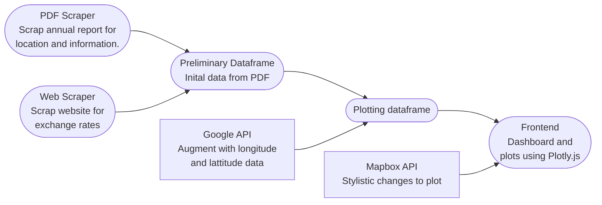

# REITs Analytics

Real Estate Investment Trusts are a popular investment choice amongst the retail investors in Singapore. Ascendas Reit (SGX: A17U) is the oldest listed reit on the SGX.

Ascendas Reit is unique as an industrial reit, as it has an extensive range of industrial properties (business parks to flatted factories) both within Singapore and across the world.

In this project, I would like to showcase:


---

- [REITs Analytics](#reits-analytics)
  - [1. General Instructions](#1-general-instructions)
    - [1.1 API keys](#11-api-keys)
    - [1.2 Folder Structure](#12-folder-structure)
  - [2. Data Ingestion Pipeline](#2-data-ingestion-pipeline)
    - [Pipeline Diagram as below:](#pipeline-diagram-as-below)
  - [3. Introduction to Mapbox](#3-introduction-to-mapbox)
  - [4. Navigation](#4-navigation)


---
## 1. General Instructions

Create virtual environment and download necessary packages using:

```bash
conda create --name reits-analytics python=3.11
conda activate reit-analytics
pip install -r requirements.txt
```

To start the backend, please follow the instructions under [API Keys](#api-keys) before keying in the following commands:

```bash
python -m src.main
```
To view the dashboard, use a browser of your choice and navigate to:

```bash
localhost:8050
```

---
### 1.1 API keys

This project makes use of API's from google and mapbox

Please see the documentation to obtain the correct API keys.
- [Mapbox api](https://docs.mapbox.com/help/getting-started/access-tokens/)
- [Google developer api](https://support.google.com/googleapi/answer/6158862?hl=en)

Please note that you should never expose your API key online. 
Make use of .env and .gitignore to hide your keys. 

Please also read this article if you are new to API keys:  
- [Best practice for keeping secrets](https://jonathansoma.com/lede/foundations-2019/classes/apis/keeping-api-keys-secret/)
  
Both API's used in this projects have a rate use limit and the credit card component is to prevent abuse of the API endpoint.


---
### 1.2 Folder Structure

This is the folder structure for this project: 

```bash
.
├── data
│   ├── Ascendas-Reit-Annual-Report-2021.pdf
│   └── output.csv
├── README.md
├── # place .env file here
├── requirements.txt
└── src
    ├── app_func
    │   ├── api.py
    │   ├── dbs_fx.py
    │   └── pdf.py
    ├── main.py
    └── test.ipynb
```
---
## 2. Data Ingestion Pipeline

The baseline data is taken from the Ascendas Reit's Annual Report 2021. 

Data augmented using:
- DBS's forex website [link](https://www.dbs.com/in/treasures/rates-online/foreign-currency-foreign-exchange.page)
- Google maps for longitude and lattitude data

Frontend and Visualization using: 
- Plotly.js for dashboard frontend 
- Mapbox for stylistic changes to plots

### Pipeline Diagram as below:


---
## 3. Introduction to Mapbox

Unlike other types of data vizualization (barplot, pie charts, etc) geo-location data is best presented given the geographical context. However, maps unlike other data vizualization are not easily customizable.

Mapbox offeres an alternative to the static map graphs available by giving users the ability to customize the visible artifacts in the map. Even fine grain details like including specific traffic/congestion data are available.

By signing up with mapbox one can easily customize and save the specific type of map for their use case and render them by using the specified API key unique to the user.


---
## 4. Navigation

Front end navigation should allow the user to view the various location of the reit properties as well as valuations by size of circle.


